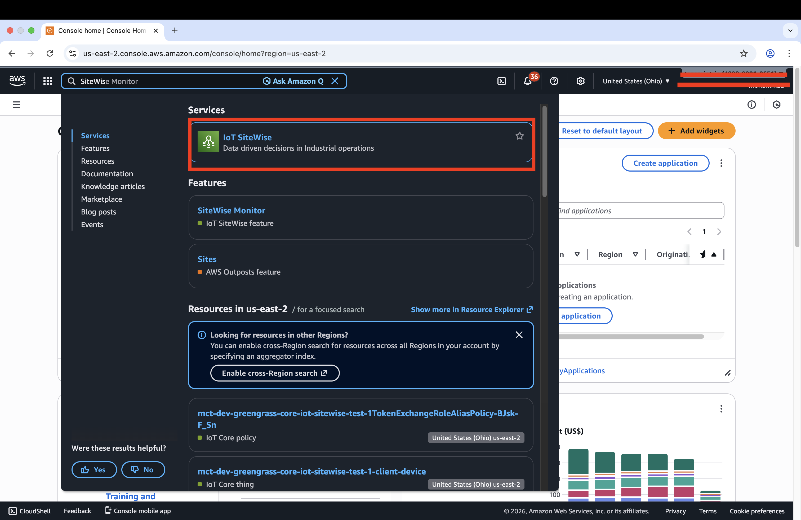
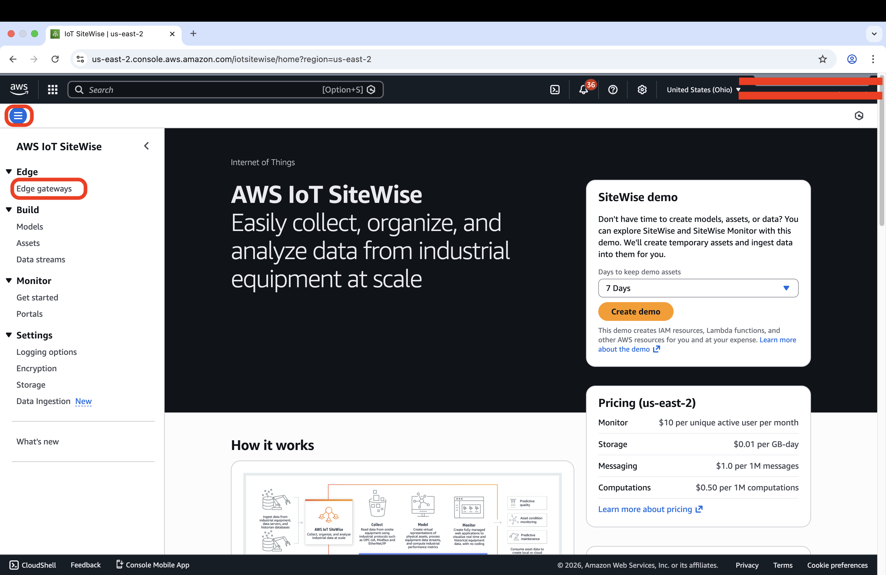
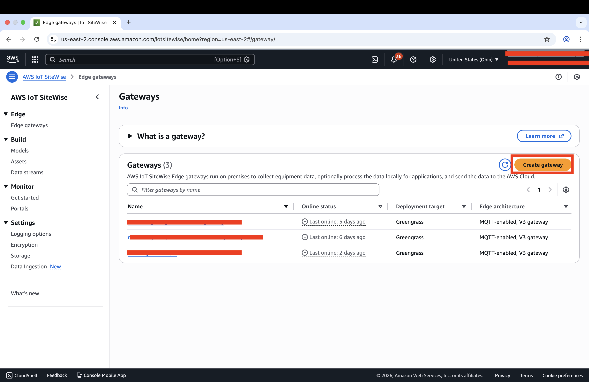
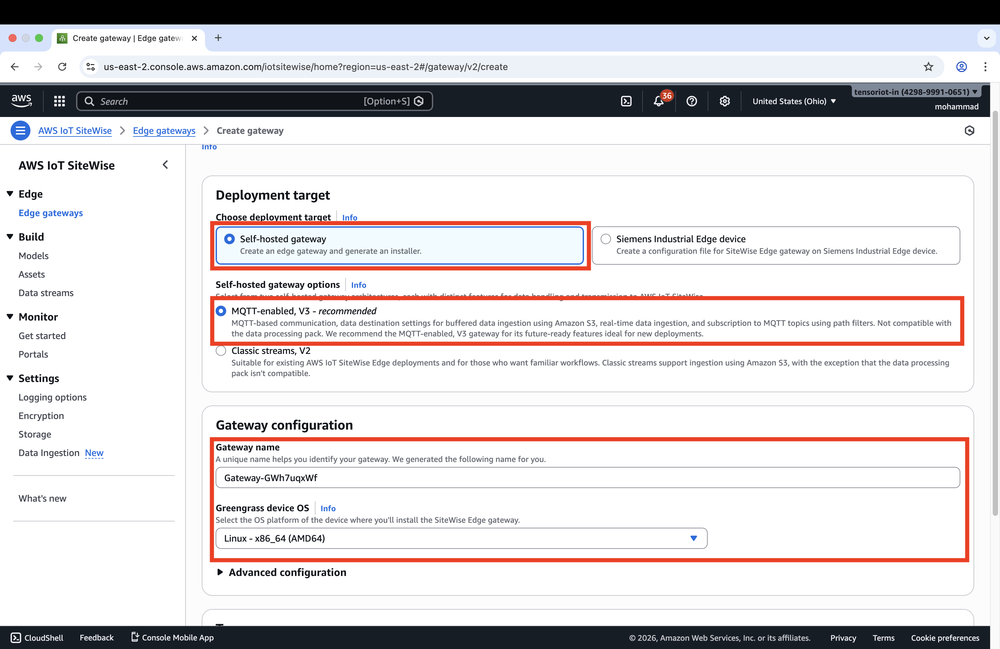
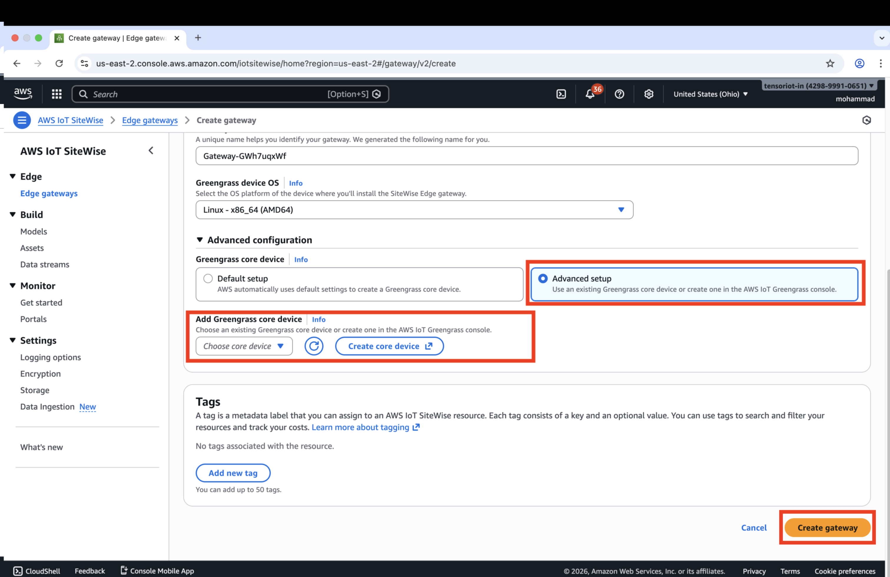
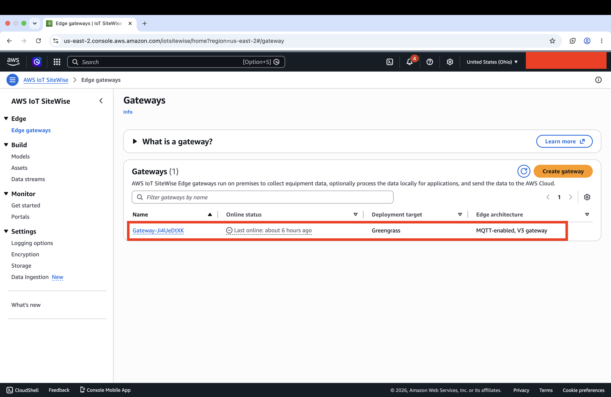
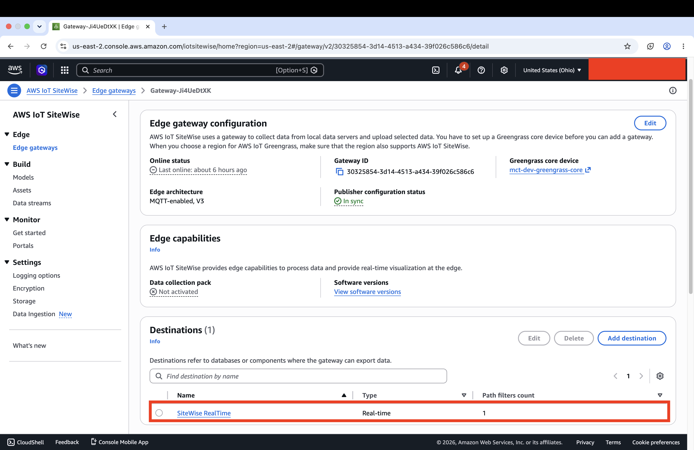
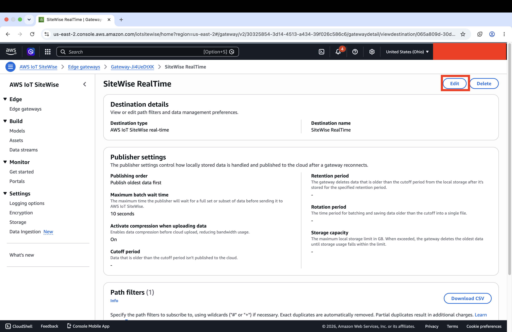
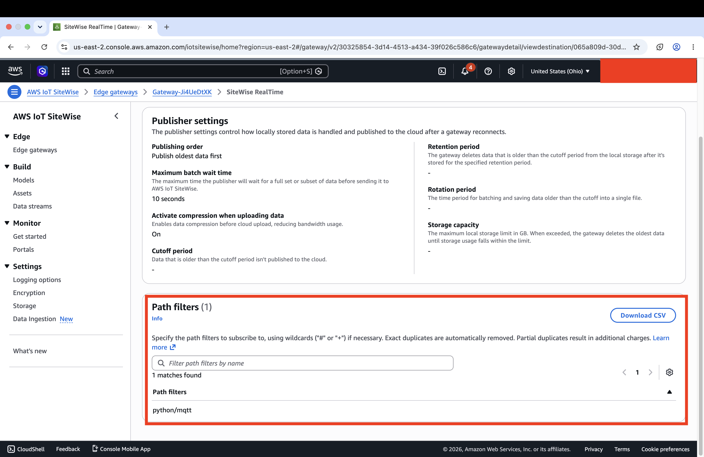

# AWS IoT Greengrass — Edge Provisioning & Deployment Scripts

This repository contains three shell scripts used to set up an AWS IoT Greengrass V2 edge gateway, deploy custom data-processing components to it, and provision local MQTT client devices against it.

| Step | File | Where | Purpose |
|------|------|--------|---------|
| 1 | `01_Install_greengrass.sh` | Edge device (shell) | One-time setup of the Greengrass **Core** — installs dependencies, registers the device in AWS IoT, installs the Greengrass Nucleus, and deploys foundational gateway components |
| 2 | *(no script)* | **AWS Console** | Attach an **IoT SiteWise Edge Gateway** to the running Core — done entirely through the AWS web console, no script needed |
| 3 | `03_deploy_components.sh` | Edge device (shell) | Builds, registers, and deploys/updates **custom Greengrass components** (Live, Storage, Reporting, Shadow Sync, Logger) and optionally updates the local EMQX broker config |
| 4 | `04_provision_client_device.sh` | Edge device (shell) | Registers a **local client device** (e.g. a PLC or sensor) so it can connect to the Core's local MQTT broker |

> The file names (`01_`, `03_`, `04_`) reflect this overall order — **Step 2 is intentionally a console action**, which is why there is no `02_` script.

Run in order: **Step 1 → Step 2 (console) → Step 3 (as needed) → Step 4 (per client device)**.

---

## 1. Prerequisites

Make sure these are in place *before* running any script.

### 1.1 Where these scripts run
All three scripts must be run **directly on the edge device** (the Linux machine that will become, or already is, the Greengrass Core). They are not run from your laptop against a remote device.

### 1.2 Operating system
- Ubuntu Linux (the scripts use `apt-get` and `snap`)
- Run as **root** or with passwordless `sudo`, since the scripts install system packages and write to `/greengrass`, `/etc`, etc.

### 1.3 AWS account & credentials
- An AWS account with permissions for: **IoT Core**, **IoT Greengrass V2**, **S3**, **STS**, and (if using SiteWise) **IoT SiteWise**.
- AWS CLI v2 configured on the device with valid credentials, e.g.:
  ```bash
  aws configure
  ```
  or an attached IAM role/instance profile with equivalent permissions.
- The following must already exist in your AWS account (script 1 does **not** create them):
  - An IoT **policy** for the Core device (`--policy-name`)
  - An IoT **Role Alias** for the Greengrass Token Exchange Service (`--role-alias`), with its associated IAM role granting Greengrass the permissions it needs (S3 read for component artifacts, IoT Data/SiteWise access, etc.)

### 1.4 Network access
The device needs outbound internet access to reach:
- AWS IoT / Greengrass / STS / S3 API endpoints
- `https://d2s8p88vqu9w66.cloudfront.net` (Greengrass Nucleus download)
- `https://www.amazontrust.com` (Amazon Root CA download)
- `https://download.docker.com` (Docker install)
- Standard Ubuntu package mirrors

### 1.5 Tools the scripts expect to find or will install
Installed automatically by **script 1** if missing: `openjdk-11-jdk`, `python3`, `python3-pip`, `curl`, `jq`, `zip`/`unzip`, AWS CLI, Docker.
Required by **scripts 3 and 4** (install beforehand if not already present from script 1): `aws` CLI, `jq`, `openssl`.

> **Note on script 1's commented-out `sudo-rs` block:** `01_Install_greengrass.sh` contains an *active* step that detects and swaps `sudo-rs` for classic `sudo` if present, and a **commented-out** block at the bottom of `04_provision_client_device.sh` that would reinstall `sudo-rs` and remove `sudo` again. This is unrelated to Greengrass functionality and modifies a core system utility — review this section with your security/ops team before ever uncommitting or relying on it.

---

## 2. Script 1 — `01_Install_greengrass.sh`

**What it does**, step by step:
1. Installs Java, Python, AWS CLI, Docker, and other OS prerequisites.
2. Creates the Core **IoT Thing**, generates a device certificate, and attaches your IoT policy.
3. Downloads and installs the **Greengrass Nucleus**, registers it as a systemd service, and starts it.
4. Initializes a default AWS IoT **Device Shadow** named `config`.
5. Deploys foundational gateway components: `aws.greengrass.Cli`, `aws.greengrass.clientdevices.Auth` (client-device auth), and `aws.greengrass.clientdevices.mqtt.Bridge` (local↔cloud MQTT bridge).

### Usage
```bash
sudo ./01_Install_greengrass.sh \
  --region <aws-region> \
  --thing-name <core-thing-name> \
  --policy-name <existing-iot-policy-name> \
  --role-alias <existing-role-alias-name> \
  --sub-topic "<mqtt-topic-pattern>"
```

### Example
```bash
sudo ./01_Install_greengrass.sh \
  --region us-east-2 \
  --thing-name mct-dev-greengrass-core \
  --policy-name mct-dev-iot-thing-policy \
  --role-alias GreengrassTESCertificatePolicy-mct-greengrass-edge-device-role-alias \
  --sub-topic "oa/us/dna/dttp/dttp/+/+/+"
```

| Flag | Required | Description |
|---|---|---|
| `--region` | Yes | AWS region, e.g. `us-east-2` |
| `--thing-name` | Yes | Name to register the Core device as in AWS IoT |
| `--policy-name` | Yes | **Existing** IoT policy to attach to the Core's certificate |
| `--role-alias` | Yes | **Existing** Token Exchange Service role alias |
| `--sub-topic` | Yes | MQTT topic pattern bridged from the local broker to AWS IoT Core |

### After it finishes
- Check service status: `sudo systemctl status greengrass.service`
- Tail logs: `sudo tail -f /greengrass/v2/logs/greengrass.log`

---

## 3. Step 2 — Enable SiteWise Edge Gateway (AWS Console)

This step has no script — it is done entirely through the **AWS IoT SiteWise web console**. It attaches an AWS IoT SiteWise Edge Gateway to the Greengrass Core provisioned in Step 1. The console automatically deploys the required SiteWise Greengrass components and wires up IAM permissions.

> **Do this after Step 1 completes and before running `03_deploy_components.sh`**, since the SiteWise deployment occupies the active Greengrass deployment slot that script 3 will later update.

### Prerequisites for this step
- The Core device from Step 1 must be **online** — confirm with `sudo systemctl status greengrass.service`.
- Your AWS IAM user needs **IoT SiteWise** permissions in addition to those required for Step 1.
- The Core device's IAM role must include the `AWSIoTSiteWiseEdgeAccess` managed policy (or equivalent). The console setup handles this automatically if your IAM user has sufficient permissions.

---

### Part A — Create the Gateway

**1. Open the AWS IoT SiteWise console**

In the AWS Console search bar, type `SiteWise` and select **IoT SiteWise** from the results (highlighted in red below).



---

**2. Navigate to Edge Gateways**

Once in the SiteWise console, look at the left navigation pane. Under the **Edge** section, click **Edge gateways** (highlighted in red below).



---

**3. Click Create gateway**

On the Gateways list page you will see any existing gateways. Click the orange **Create gateway** button in the top-right of the table (highlighted in red below).



---

**4. Configure deployment target and gateway settings**

The Create gateway form opens. Fill in the following fields (all highlighted sections in the screenshot below):

- **Deployment target** → select **Self-hosted gateway**
- **Self-hosted gateway options** → select **MQTT-enabled, V3 – recommended**
- **Gateway name** → the console auto-generates a name (e.g. `Gateway-GWh7uqxWf`) — you can rename it to something descriptive
- **Greengrass device OS** → select **Linux - x86_64 (AMD64)** or the architecture matching your device



---

**5. Select your existing Greengrass Core and create**

Scroll down to the **Advanced configuration** section. Two fields are highlighted below:

- Under **Greengrass core device**, select **Advanced setup** (right radio button) — this lets you link an existing Core instead of creating a new one automatically.
- From the **Choose core device** dropdown, select the Core device name you registered in Step 1.

Then click the orange **Create gateway** button at the bottom-right of the page.



> If your device does not appear in the dropdown, verify it is online and that your IAM user has `greengrass:ListCoreDevices` permission.

---

### Part B — Verify the Gateway

**6. Confirm the gateway appears in the list**

After creation you are returned to the Gateways list. Your new gateway appears with its name linked (highlighted in red). The deployment target shows **Greengrass** and the architecture shows **MQTT-enabled, V3 gateway**. The online status will update to **Online** once the Greengrass deployment completes on the device (usually within a few minutes).



---

**7. Open the gateway detail and check status**

Click the gateway name to open its detail page. Confirm the following fields (highlighted in red):

- **Publisher configuration status** → **In sync** (green checkmark)
- **Greengrass core device** → your Core device name, linked
- **Edge architecture** → MQTT-enabled, V3
- **Destinations** section at the bottom shows a **SiteWise RealTime** destination was created automatically — click it to proceed



You can also verify from the Core device itself:

```bash
# List all running Greengrass components (SiteWise ones should appear here)
sudo /greengrass/v2/bin/greengrass-cli component list

# Tail the SiteWise publisher log for any errors
sudo tail -f /greengrass/v2/logs/aws.iot.SiteWiseEdgePublisher.log
```

---

### Part C — Update the Path Filter

**8. Open the SiteWise RealTime destination and click Edit**

On the destination page, you can see **Publisher settings** (publishing order, batch wait time, compression) and the **Path filters** section at the bottom. Click the **Edit** button in the top-right (highlighted in red) to modify the destination.



---

**9. Locate the default path filter `#`**

In Edit mode, scroll down to **Path filters**. The default filter value is **`#`** (highlighted in red below).

> **`#` is an MQTT wildcard that matches every topic on the broker.** Leaving it as `#` means all internal Greengrass system topics, heartbeats, and any other application traffic get forwarded to SiteWise — driving up ingestion costs and polluting your data streams. **Always change this to your actual data topic before going to production.**


---

**10. Replace `#` with your specific topic**

Click the pencil icon next to the `#` entry to edit it inline. Type your actual MQTT topic — in this setup it is `python/mqtt` (for production use your real pattern such as `oa/us/dna/dttp/dttp/+/+/+`). Then click the blue **✓ checkmark** labelled **Save path filter** (highlighted in red) to confirm the inline edit, then click the orange **Save** button at the bottom-right to save the destination.


---

**11. Confirm the updated path filter**

Back on the SiteWise RealTime destination view, the **Path filters** section (highlighted in red) now shows `python/mqtt` instead of `#`. The update is complete.



---

Once the gateway shows as **In sync** and the path filter is updated, proceed to Step 3 (`03_deploy_components.sh`) to deploy the custom data-processing components.

---

## 4. Script 3 — `03_deploy_components.sh`

Run this **after** script 1, any time you need to deploy a new version of a custom component or tweak the local EMQX broker. It updates the *existing* Greengrass deployment rather than replacing it, so other running components are left untouched.

**What it does:**
1. For each component flag you pass, generates a Greengrass recipe and registers that component version in your account (artifacts are pulled from an S3 bucket you provide).
2. Fetches the Core device's current effective deployment.
3. Optionally merges in updated EMQX broker settings (TLS port 443, auth mode, etc.).
4. Merges the new/updated components into the deployment and triggers a new deployment to the Core.

### Usage
```bash
./03_deploy_components.sh [-l <live_ver>] [-s <storage_ver>] [-r <reporting_ver>] \
  [-w <shadow_ver>] [-c <logger_ver>] [-e] \
  -m <sitewise_model_name> -t <mqtt_topic> -b <s3_bucket> \
  [-n <shadow_name>] [-d <retain_days>]
```

### Flags

| Flag | Required? | Description |
|---|---|---|
| `-l <version>` | Optional | Deploy/update `com.data.transform.live` |
| `-s <version>` | Optional | Deploy/update `com.data.transform.storage` |
| `-r <version>` | Optional | Deploy/update `com.data.transform.reporting` |
| `-w <version>` | Optional | Deploy/update `com.data.transform.shadow.sync` |
| `-c <version>` | Optional | Deploy/update `com.data.transform.logger` |
| `-e` | Optional | Update the existing EMQX broker config (TLS/port/auth) |
| `-m <model>` | **Yes** | AWS IoT SiteWise model name (used by Reporting component) |
| `-t <topic>` | **Yes** | MQTT sub-topic pattern |
| `-b <bucket>` | **Yes** | S3 bucket holding your component code artifacts |
| `-n <name>` | Conditional | Required if using `-w` (AWS IoT Shadow name) |
| `-d <days>` | Conditional | Required if using `-c` (CSV log retention, in days) |

You must specify **at least one** of `-l`, `-s`, `-r`, `-w`, `-c`, or `-e` — running with only the required global flags and nothing else will error out.

### Example — deploy all components and update EMQX
```bash
./03_deploy_components.sh \
  -l 1.0.3 -s 2.1.0 -r 1.1.0 -w 1.0.1 -c 1.0.0 -e \
  -m dnadct-oa2-dev-mct-model_core \
  -t "oa/us/dna/dttp/dttp/+/+/+" \
  -b greengrass-core-bucket \
  -n "config" \
  -d "7"
```

### Example — update only the Reporting component
```bash
./03_deploy_components.sh \
  -r 1.2.0 \
  -m dnadct-oa2-dev-mct-model_core \
  -t "oa/us/dna/dttp/dttp/+/+/+" \
  -b greengrass-core-bucket
```

### Prerequisite for this script specifically
- Must be run on a device that has **already** been provisioned by script 1 (it reads the Core's `thingName`/region from `/greengrass/v2/config/effectiveConfig.yaml`).
- The S3 bucket (`-b`) must already contain the component artifact files (e.g. `live_state_engine.py`) at the expected path: `s3://<bucket>/artifacts/<component-name>/<version>/<filename>`.

---

## 5. Script 4 — `04_provision_client_device.sh`

Run this once **per local client device** (e.g. an edge sensor, PLC gateway, or test client) that needs to publish/subscribe to the Greengrass Core's local MQTT broker.

**What it does:**
1. Verifies the Core device exists in AWS IoT.
2. Creates an IoT Thing, certificate, and key pair for the **client device**.
3. Attaches the certificate to the client Thing and ensures an IoT policy (allowing Connect/Publish/Subscribe/Receive) is attached.
4. Associates the client device with the Greengrass Core so it's authorized to use the local broker.
5. Updates the Core's connectivity info with the broker's reachable IP/host.
6. Extracts the broker's CA certificate from a live TLS connection so the client can validate the broker.

### Usage
```bash
sudo ./04_provision_client_device.sh \
  --client-thing-name <client-device-name> \
  --broker-host <ip-address-of-broker>
```

### Example
```bash
sudo ./04_provision_client_device.sh \
  --client-thing-name plc-line-3-sensor \
  --broker-host 192.168.1.50
```

| Flag | Required | Description |
|---|---|---|
| `--client-thing-name` | Yes | Name to register the client device as in AWS IoT |
| `--broker-host` | Yes | IP address (or hostname) where the local MQTT broker is reachable |

### Prerequisite for this script specifically
- Must be run on (or have access to the config of) a device already provisioned by script 1, since it reads the Core's region/thing name from `/greengrass/v2/config/effectiveConfig.yaml`.
- The broker (port `443`, hardcoded in the script) must be up and reachable from where you run this script, since the last step opens a live TLS connection to extract its CA certificate.

### Output
On success, client certificates are written to `./client_device_certs/`:

| File | Purpose |
|---|---|
| `device.pem.crt` | Client device certificate |
| `private.pem.key` | Client device private key (permissions set to `600`) |
| `AmazonRootCA1.pem` | Amazon Root CA (for connecting to AWS IoT directly) |
| `RootCA.pem` | CA certificate extracted from the local broker (for connecting to the local broker) |

Copy this entire folder to the client device and point your MQTT client at it, along with `--broker-host` and port `443`.

---

## 6. Typical End-to-End Flow

```bash
# Step 1 — Provision the Greengrass Core (once per gateway device)
sudo ./01_Install_greengrass.sh \
  --region us-east-2 \
  --thing-name my-core-device \
  --policy-name my-core-policy \
  --role-alias my-role-alias \
  --sub-topic "factory/+/+/data"

# Step 2 — Enable SiteWise Edge Gateway (AWS Console — no script)
# Open https://console.aws.amazon.com/iotsitewise → Edge gateways → Create gateway
# Select "Self-hosted gateway", choose your Core device, click Create.
# Wait for status to show Healthy before continuing.

# Step 3 — Deploy custom data-processing components (repeat for new versions)
./03_deploy_components.sh \
  -l 1.0.0 -s 1.0.0 \
  -m my-sitewise-model \
  -t "factory/+/+/data" \
  -b my-artifacts-bucket

# Step 4 — Provision each client device that needs MQTT access (once per device)
sudo ./04_provision_client_device.sh \
  --client-thing-name sensor-01 \
  --broker-host 192.168.1.50
```

---

## 7. Troubleshooting Tips

- **`Thing already exists` message during script 1 or 4**: Harmless — the scripts use `|| true` / `|| echo` so re-running is safe and won't fail on a Thing that's already registered.
- **Core device not appearing in the SiteWise console dropdown (Step 2)**: Confirm the device is online (`systemctl status greengrass.service`) and that your IAM user has `greengrass:ListCoreDevices` permission.
- **SiteWise gateway stays in "Deploying" state**: Check the Greengrass deployment log on the Core device — `sudo tail -f /greengrass/v2/logs/greengrass.log`. Common causes are missing IAM permissions on the Core's role or network connectivity issues reaching SiteWise endpoints.
- **Script 3 or 4 can't find `effectiveConfig.yaml`**: Confirm script 1 completed successfully and Greengrass is running (`systemctl status greengrass.service`) on this device.
- **CA certificate extraction fails in script 4**: Make sure the EMQX/local broker component is deployed and listening on port 443 before running this script (it relies on a live `openssl s_client` connection).
- **Permission errors**: Run all scripts with `sudo` or as root — they write to `/greengrass`, install OS packages, and set file permissions.
